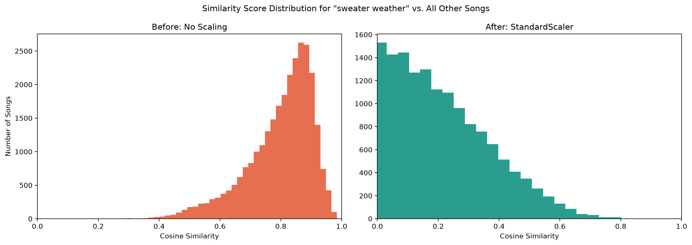

# Content-Based Music Recommender: What Feature Scaling Taught Me About Cosine Similarity

## Overview
For each input song this system recommends *N* similar songs from the 28,372 songs in the dataset based on the cosine similarity between feature vectors (comprising 16 lyrical thematic scores, 6 audio features, and song age — 23 dimensions in total). In addition to building the model the main focus of the project has been to examine the impact of various data normalization methods on the quality of the recommendations

## Dataset
The dataset used [tcc_ceds_music.csv](https://www.kaggle.com/datasets/saurabhshahane/music-dataset-1950-to-2019) contains 28,372 songs released between 1950 and 2019. In addition to basic information (artist name, title, genre, release year), each song has 16 lyrical theme score columns (such as dating, violence, romantic), 6 extracted audio features (such as danceability, energy, valence), and song age (derived from release year)

## Key Finding
The initial experiment, run without any explicit scaling, produced
similarity scores that were all nearly identical (e.g., 0.979–0.985),
meaning the model could not meaningfully distinguish between songs.
Explicitly applying `MinMaxScaler` barely improved this. Suspecting
high dimensionality as the cause, PCA was tested next — but this made
the problem worse, not better.

Inspecting the component loadings showed why: the first principal
component was dominated almost entirely by acousticness, energy,
and age, while the 16 lyrical-topic features contributed
comparatively little. Instead of resolving the underlying issue, PCA
compressed the space into directions shaped mostly by a handful of
correlated dimensions — leaving the core problem intact:
since MinMax-scaled values are all non-negative, every
song's feature vector remained confined to a narrow, low-angle region
of the space, keeping the angle between any two vectors artificially
small regardless of how different the songs actually are.

Switching to `StandardScaler` — which centers each feature around a
mean of zero — resolved this. It allowed vectors to point in genuinely
different directions, and the similarity scores spread out into a much
more meaningful range (e.g., 0.77–0.83), producing clearly better
differentiation between dissimilar songs.


*Distribution of cosine similarity between "Sweater Weather" and the 
other 28,371 songs in the dataset — before and after StandardScaler.*


## Tech Stack
- numpy
- pandas
- matplotlib
- seaborn
- scikit-learn
- jupyterlab

## How to Run
1. Clone the repository:
```bash
git clone https://github.com/Ali-reza-rn/content-based-music-recommender.git
cd content-based-music-recommender
```

2. Install dependencies:
```bash
pip install -r requirements.txt
```

3. Download the dataset from [Kaggle](https://www.kaggle.com/datasets/saurabhshahane/music-dataset-1950-to-2019) and place `tcc_ceds_music.csv` in the project root.

4. Launch the notebook:
```bash
jupyter lab music-recommendation.ipynb
```

## Example Output
```python
recommendations = get_recommendations("sweater weather", data, features_scaled, 10)
```

| track_name       | artist_name            | genre   | similarity |
|------------------|-------------------------|---------|------------|
| keep on          | the green               | reggae  | 0.8015     |
| outrage! is now  | death from above 1979   | blues   | 0.7993     |
| skin & bones     | eli young band          | country | 0.7991     |
| fear             | ben rector               | rock    | 0.7935     |
| fraccions        | soen                     | jazz    | 0.7806     |

## Limitations & Future Work
**Known limitations:**
- Some overlap between thematically different songs still remains,
  even after StandardScaler.
- `genre` was not included in the feature vector (see Feature
  Selection) so recommendations are based purely on audio and
  lyrical similarity and can freely cross genre boundaries — e.g.,
  recommendations for "Sweater Weather" (indie pop) include reggae,
  blues, and country tracks. This is expected given the current
  feature set not a bug but may matter depending on the use case.

**Possible next steps:**
- Apply separate weighting to lyrical vs. audio features, rather
  than treating all 23 dimensions equally.
- Deploy the model as a simple web app (e.g., with Streamlit).
